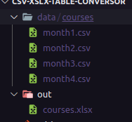

# CSV to XSlX format

This is a lightweight Python script that allows you to convert CSV (Comma-Separated Values) files to XLSX (Microsoft Excel) format. It provides a simple and straightforward way to convert your data from CSV to XLSX, making it easier to work with spreadsheets and take advantage of Excel's features.

## Installation

1. Clone this repository to your local directory

```bash
git clone https://github.com/gustaoliveira1/csv-xlsx-table-conversor.git
```

2. Install dependencies

```bash
pip install pandas openpyxl
```

## Usage

1. Place files in the **data** directory

- If there are CSV files directly inside the "data" directory, each file will be converted into a separate workbook file.
- If there is a folder inside the "data" directory containing CSV files, the folder itself will be converted into a workbook file, and each CSV file inside it will become a separate worksheet within that workbook.

2. Run the main file

```bash
python main.py
```

3. Converted files will be output in the out directory


